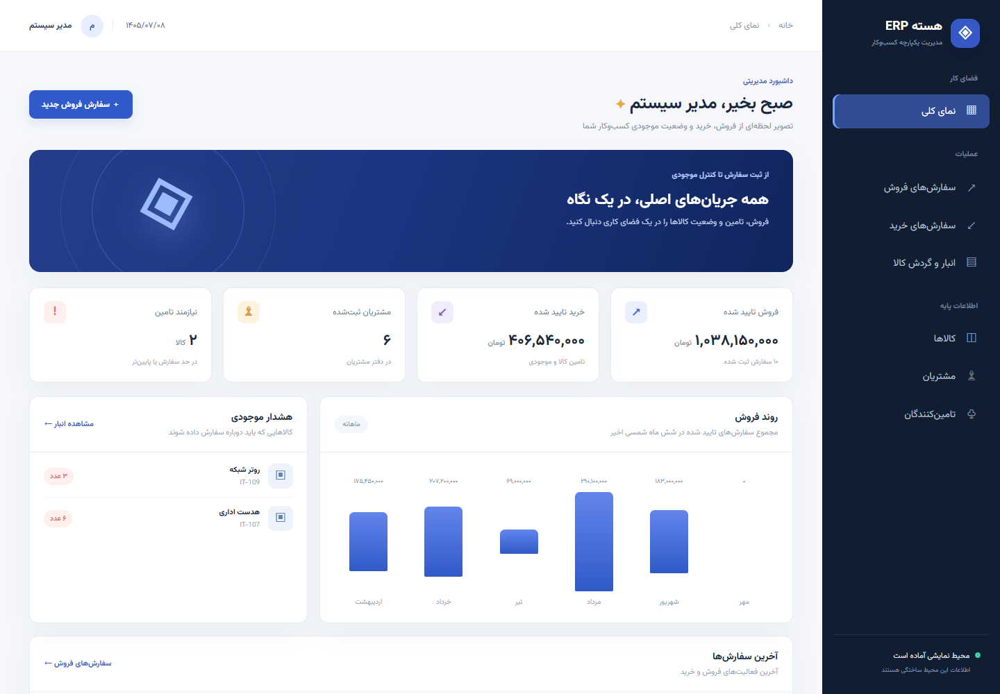

# نمونه نمایشی ERP با Django

این پوشه یک نمونه **مستقل** برای نمایش به مدیر است. مدل‌های مشتری، تامین‌کننده، کالا، سفارش فروش، سفارش خرید و گردش موجودی از مفاهیم ERPNext الهام گرفته‌اند، اما این برنامه به Frappe یا پروژه `django_port` متصل نیست و فایل‌های آن پروژه را تغییر نمی‌دهد.

مسیر تکمیل مرحله‌ای و معیار پذیرش هر بخش در [چک‌لیست پروژه](CHECKLIST.md) آمده است.

سناریوهای ارائه و تفاوت این نمونه با ERPNext در [طرح ارائه](docs/PRESENTATION_PLAN.md) ثبت شده‌اند.



نمای موبایل در [تصویر موبایل](docs/mobile.png) و فرم سفارش در [تصویر سفارش](docs/order-form.png) دیده می‌شود. قلم Vazirmatn همراه برنامه و تحت [مجوز OFL](demo/static/demo/fonts/OFL.txt) ارائه شده است.

## اجرای سریع در ویندوز

از PowerShell در همین پوشه اجرا کنید:

```powershell
.\start_demo.ps1
```

سپس نشانی `http://127.0.0.1:8000/` را در مرورگر باز کنید. راه‌انداز در اولین اجرا محیط مجازی و پایگاه‌داده SQLite را می‌سازد و دادهٔ نمونه را وارد می‌کند. اجراهای بعدی داده‌های موجود را حفظ می‌کنند. برای توقف سرور `Ctrl+C` را بزنید.

در صورت محدودیت اجرای اسکریپت PowerShell، دستور زیر را اجرا کنید:

```powershell
powershell -ExecutionPolicy Bypass -File .\start_demo.ps1
```

## سناریوی پیشنهادی نمایش

1. در «نمای کلی» شاخص‌های فروش، خرید و هشدار موجودی را ببینید.
2. در «سفارش‌های فروش» یک سفارش جدید ثبت کنید؛ قیمت کالا از کاتالوگ خوانده می‌شود.
3. سفارش را تایید و سپس تحویل کالا را ثبت کنید تا موجودی انبار کاهش یابد.
4. صورتحساب را صادر و دریافت کامل یا بخشی از وجه را ثبت کنید؛ مانده در پروندهٔ سفارش دیده می‌شود.
5. در «انبار و گردش کالا» تغییر موجودی را ببینید.
6. از «پیشنهادهای تامین» یک قلم کم‌موجودی را انتخاب کنید؛ سفارش خرید با تعداد پیشنهادی باز می‌شود.
7. خرید را تایید، دریافت کالا را ثبت، صورتحساب را صادر و پرداخت را ثبت کنید.
8. در «انبار و گردش کالا»، دفتر یک کالا را باز کنید؛ ماندهٔ قبل و بعد و دلیل هر اصلاح دیده می‌شود.

## محدوده نمونه

واحد پول در رابط کاربری تومان است. داده‌ها و گردش‌ها برای ارائه طراحی شده‌اند. صورتحساب و دریافت در این نمونه **سند مالیاتی یا ثبت حسابداری کل نیستند**. این نسخه هنوز شامل مالیات، چند انبار، سطوح دسترسی یا اتصال به داده‌های واقعی ERPNext نیست. `DEBUG` فعال است و برنامه برای اجرای محلی در نظر گرفته شده است.

برای اجرای آزمون‌ها:

```powershell
.\.venv\Scripts\python.exe manage.py test
```

