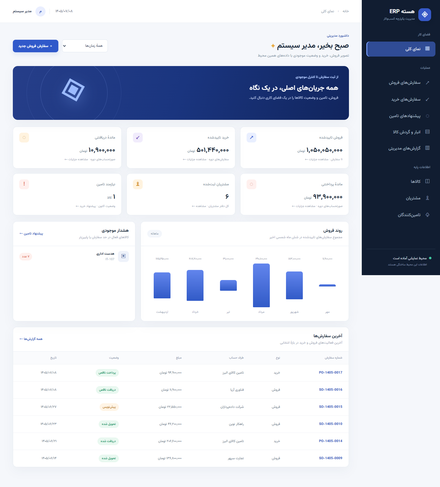

# نمونه نمایشی ERP با Django

این پوشه یک نمونه **مستقل** برای نمایش به مدیر است. مدل‌های مشتری، تامین‌کننده، کالا، BOM و درخت محصول، سفارش فروش، سفارش خرید و گردش موجودی از مفاهیم ERPNext الهام گرفته‌اند، اما این برنامه به Frappe یا پروژه `django_port` متصل نیست و فایل‌های آن پروژه را تغییر نمی‌دهد.

مسیر تکمیل مرحله‌ای و معیار پذیرش هر بخش در [چک‌لیست پروژه](CHECKLIST.md) آمده است.

[مسیر یکپارچهٔ سفارش مشتری](docs/CUSTOMER_JOURNEY.md) فروش را با ارجاع صریح به MRP، خرید و تولید متصل می‌کند و مانع و مسئول اقدام بعدی را در پروندهٔ سفارش نشان می‌دهد.

سناریوهای ارائه و تفاوت این نمونه با ERPNext در [طرح ارائه](docs/PRESENTATION_PLAN.md) ثبت شده‌اند.

فرمول شاخص‌ها، معنای فیلتر زمانی و مسیر پیگیری ارقام در [تعریف شاخص‌ها](docs/KPI_DEFINITIONS.md) آمده است.



نمای موبایل در [تصویر موبایل](docs/mobile.png) و فرم سفارش در [تصویر سفارش](docs/order-form.png) دیده می‌شود. قلم Vazirmatn همراه برنامه و تحت [مجوز OFL](demo/static/demo/fonts/OFL.txt) ارائه شده است.

## اجرای سریع در ویندوز

از PowerShell در همین پوشه اجرا کنید:

```powershell
.\start_demo.ps1
```

سپس نشانی `http://127.0.0.1:8000/` را در مرورگر باز کنید. راه‌انداز در اولین اجرا محیط مجازی و پایگاه‌داده SQLite را می‌سازد و دادهٔ نمونه را وارد می‌کند. اجراهای بعدی داده‌های موجود را حفظ می‌کنند. برای توقف سرور `Ctrl+C` را بزنید.

برای دیتابیس موجود با مهاجرت معوق، راه‌انداز پیش از ارتقا پشتیبان معتبر می‌گیرد و قالب ممیزی قدیمی شناخته‌شده را با حفظ سوابق منتقل می‌کند. [راهنمای ارتقای دیتابیس](docs/LOCAL_DATABASE_UPGRADE.md) جزئیات و شواهد را دارد. اجرای `start_demo.ps1 -PrepareOnly` دیتابیس را بدون راه‌اندازی سرور آماده می‌کند.

صفحهٔ ورود شش حساب نمایشی `manager`، `sales`، `purchase`، `warehouse`، `finance` و `production` دارد. گذرواژهٔ پیش‌فرض محلی همهٔ آنها `Demo-1405!` است. هر نقش پس از ورود به [مرکز عملیات](docs/ERP_WORKSPACE.md) خود می‌رسد و فرایندهای مجاز، میان‌برهای اجرای کار و اسناد منتظر اقدام را می‌بیند؛ نقش‌ها، روش تغییر گذرواژه، تنظیم استقرار و پشتیبان‌گیری در [راهنمای امنیت و بازیابی](docs/SECURITY_AND_RECOVERY.md) مستند شده‌اند.

عملیات انبار، فروش، خرید، صورتحساب و دریافت/پرداخت به یک [دفتر روزنامهٔ دوبل نمایشی](docs/ACCOUNTING_DEMO.md) متصل‌اند. هر رویداد سند متوازن می‌سازد و نقش حسابداری می‌تواند تراز حساب‌ها و سند مبنا را تا سطح آرتیکل پیگیری کند.

[جریان تولید نمایشی](docs/MANUFACTURING_DEMO.md) نسخهٔ فعال BOM را به سفارش ساخت، نیاز مواد، کنترل کمبود، مصرف مواد، رسید محصول نهایی و ثبت حسابداری تبدیل می‌کند.

[برنامه‌ریزی MRP](docs/MRP_DEMO.md) تقاضا را در BOM چندسطحی منفجر می‌کند، موجودی و دریافت‌های باز را خالص می‌کند و کمبودها را مستقیماً به سفارش ساخت یا خرید قابل ردیابی تبدیل می‌کند.

[قرارداد دادهٔ محصول](docs/PRODUCT_DATA.md) ساختار کالا و BOM را با JSON Schema، نمونهٔ نسخه‌پذیر، export قطعی و import اتمیک/قابل dry-run به یک artifact مناسب Git تبدیل می‌کند.

برای اجرای جلسه، [سناریوی سه‌دقیقه‌ای و کامل](docs/PRESENTATION_PACKAGE.md)، [راهنمای داده و درخت محصول](docs/PRODUCT_TREE.md) و [پاسخ پرسش‌های مدیر](docs/MANAGER_FAQ.md) آماده‌اند. مدیر می‌تواند نسخهٔ BOM را پیش‌نویس، کپی، ویرایش و فعال کند و محل مصرف هر جزء را در پروندهٔ کالا ببیند. پیش از تمرین مجدد، `reset_demo.ps1` داده‌ها را پس از گرفتن نسخهٔ پشتیبان به نقطهٔ شروع برمی‌گرداند.

برای تصمیم پس از جلسه، مدیر از منوی «تصمیم پس از ارائه» بازخورد، انتخاب معماری، اقدام بعدی، مسئول، موعد و سقف بودجه را با ردپای ممیزی ثبت می‌کند. هر تصمیم یک [دفتر Fit/Gap](docs/FIT_GAP_GUIDE.md) برای ثبت نیاز، شاهد، پوشش ERPNext، راهکار، اولویت، تلاش، هزینه و ریسک دارد و خروجی CSV می‌دهد. [ارزیابی تبدیل به محصول](docs/PRODUCTIZATION_ASSESSMENT.md)، [نقشهٔ راه پایلوت](docs/PILOT_ROADMAP.md) و [کاربرگ تصمیم](docs/POST_DEMO_DECISION.md) نیز مرز این دمو با ERPNext و `django_port` را روشن می‌کنند.

در صورت محدودیت اجرای اسکریپت PowerShell، دستور زیر را اجرا کنید:

```powershell
powershell -ExecutionPolicy Bypass -File .\start_demo.ps1
```

## سناریوی پیشنهادی نمایش

پس از بازنشانی، از کارت‌های «مسیرهای آمادهٔ جلسه» در داشبورد شروع کنید: سفارش سالم، تقاضای ۴۰ دستگاه با کمبود، تحویل‌شده با ماندهٔ وصول، و نمونهٔ تولید جزئی/کیفیت. [بستهٔ ارائه](docs/PRESENTATION_PACKAGE.md) مسیر ۳ دقیقه‌ای و ۱۰ تا ۱۵ دقیقه‌ای و اعداد قابل تطبیق را دارد.

1. سفارش ۴۰ دستگاهی را باز کنید و از مسیر یکپارچه به MRP مرتبط و کمبود مواد بروید.
2. [زمان‌بندی با تقویم کاری](docs/PLANNING_SCHEDULE.md)، [مقایسهٔ سناریوهای ۴۰/۶۰ و تاخیر تامین](docs/MANAGEMENT_SCENARIOS.md) و [هزینه و حاشیهٔ برآوردی](docs/ORDER_COST_ESTIMATES.md) را نمایش دهید.
3. از [صف تایید خرید](docs/PURCHASE_APPROVALS.md) خرید بالای سقف را تایید کنید، مواد را دریافت و زیرمونتاژ و محصول را به ترتیب بسازید.
4. تحویل، صورتحساب نوبت‌های جدید و وصول را ثبت کنید؛ رفع [هشدارهای زنده](docs/MANAGEMENT_EXCEPTIONS.md)، موجودی و سند دوبل را تطبیق دهید.
5. در نمونهٔ [عملیات جزئی و کیفیت](docs/PARTIAL_OPERATIONS.md)، ۲۳ واحد قبول، ۲ مردود، ۱۵ باقیمانده و تحویل ۱۰ واحد را نشان دهید؛ پرداخت قبلی با صورتحساب نوبت بعد حفظ می‌شود.
6. محدوده و تصمیم واقعی جلسه را با مالک اقدام، موعد و Fit/Gap ثبت کنید.

[شواهد اجرای کامل مرورگری](docs/presentation-verification.json) شامل موجودی ابتدا/انتها و تطبیق اسناد است. برای QA مستقل، `config.settings_verify` از فایل جداگانهٔ `backups/manager-verify.sqlite3` استفاده می‌کند؛ `browser_qa.py` تصویر صفحه‌ها و `presentation_qa.py` مسیر اصلی را از طریق فرم‌های واقعی بررسی می‌کنند.

## محدوده نمونه

واحد پول در رابط کاربری تومان است. داده‌ها و گردش‌ها برای ارائه طراحی شده‌اند. حسابداری دوبل نمایشی، تولید جزئی، کنترل کیفیت ساده و MRP چندسطحی وجود دارند؛ صورتحساب‌ها و دفتر روزنامه جایگزین سند قانونی/مالیاتی نیستند. تقویم، زمان تامین، هزینه و حاشیه برآوردی‌اند؛ ظرفیت ماشین/نیروی انسانی، رزرو اختصاصی، چند انبار، مالیات و اتصال به داده‌های واقعی ERPNext پیاده نشده‌اند. تنظیمات محلی `DEBUG` را فعال می‌کنند و برای استقرار باید از تنظیمات deploy مستندشده استفاده شود.

برای اجرای آزمون‌ها:

```powershell
.\.venv\Scripts\python.exe manage.py test --settings=config.settings_test
```

